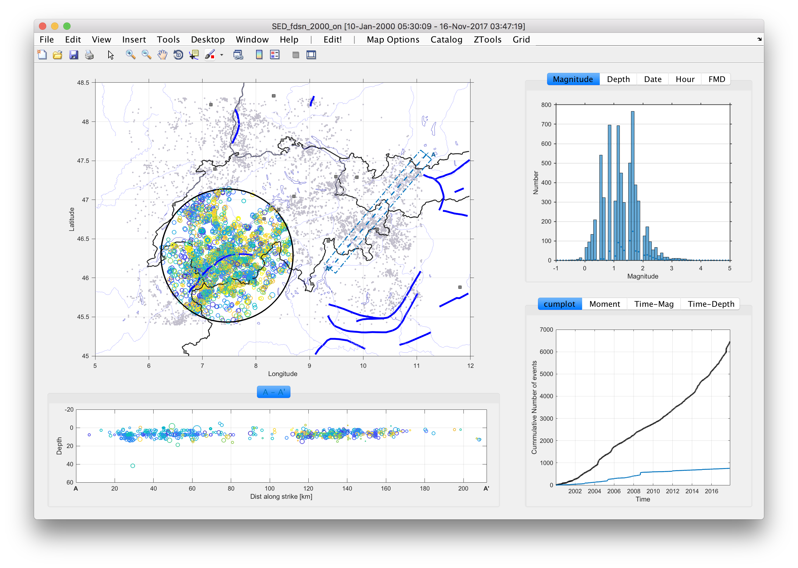
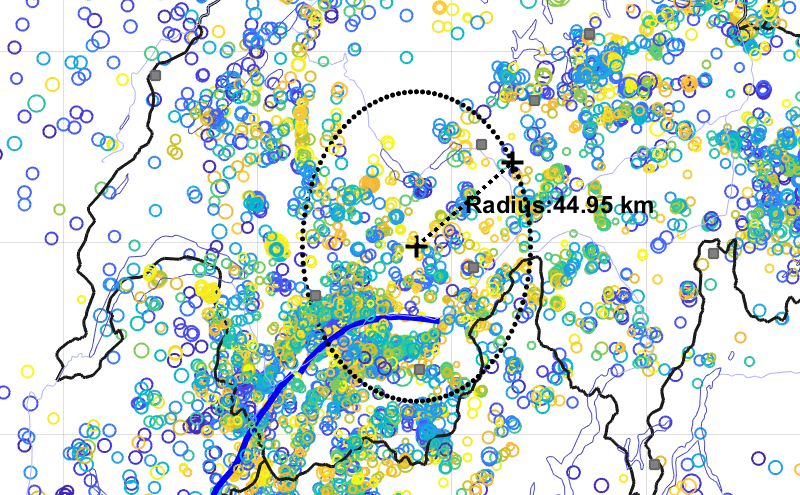
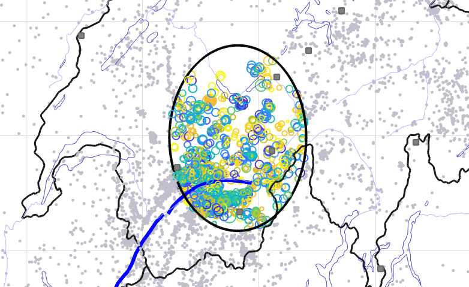

# Zmap version 7.X Readme

## About

ZMAP version7.X represents a major rework of ZMAP.

## Requirements

### ZMAP requires:
- __MATLAB R2018a__ (Version 9.4) or higher
- Mapping Toolbox
- Statistics and Machine Learning Toolbox

### To leverage the parallel computing abilities:
- Parallel Computing Toolbox

### Some functions also require:
- Optimization toolbox.

### About ZMAP7

Nearly every aspect of the program has been modified, with the following goals in mind:

*  Make ZMAP compatible with modern MATLAB installations
*  Make it easer to add additional functionality
*  Make the user interfaces more consistent and interactive.
*  Make code more robust (leveraging MATLAB functions and objects)
*  Make existing code more readable and maintainable (reducing code duplication)
*  Retrieve event data from online services (FDSN web services)
 
**Be aware, the changes in ZMAP are extensive**, and not all previously existing features may still exist. Also, you may not be able to load existing save files.
ZMAP7 should work from Matlab 2018a upwards.
 
**Since this is an *alpha* version, expect that there are many areas that are still under construction**. Menu items will likely move around, and figures will change.  However, the basic functionality is there and should be able to help you start to explore your seismology data. We look forward to your feedback and idea for what we should include.
 
If (when) you run into bugs, feel free to report through creating a GitHub issue. (“Report a ZMAP issue” , under the “Help” menu on the ZMAP windows.  Please, do not send reports through email, as the issue list will be accessible by both whomever continues to maintain this program and the community.  The issues can be properly documented, prioritized, and addressed. 
 
To get started with git, and ZMAP7, I created a few movies:
https://www.youtube.com/playlist?list=PLXUrwVIXIt9wQ5gkCP5B96k8EHzAX6bJX 
[Note: these may already be severely out-of-date]

## Getting Started

### Quick Start

1. Download or clone ZMAP 7 to your computer. 
1. Start MATLAB.
1. Change directory to the zmap directory
1. in the MATLAB command line, type "zmap"

> some sample data for Switzerland can be found in the file `zmap/resources/sample/SED_fdsn_2000_on.mat`

> Video: https://www.youtube.com/embed/gONcFBy4p8U?end=79

### Work flow

Most work will happen in the Main ZMAP screen.  

### Loading data

From the main ZMAP window, choose the `catalog` menu, then select `get/load catalog` where you will be presented with several options including:

* `from (*.mat file)` : retreive a catalog saved into a matlab data file.  Some sample data can be found in zmap/resources/sample

* `from FDSN service` : retrieve a catalog from an FDSN web service

* `from other formatted file` : this contains mostly unmaintained functions to import from other sources.

Clicking on the `see distributions` button will show a few histograms that may help you decide where to set your parameters

## The Main interfaces

### Main Map Screen

Once a catalog is loaded, earthquakes will be plotted in the Main Window.

This is where most of the work will happen.  The screen is divided into several sections.  When first presented, all events will be hilighted, and the main map will take up the entirety of the left side of the window.

The plots on the right side of the screen will reflect statistics for the entire catalog.

#### map features

Several features are plotted on the map along with the earthquakes. Which ones are shown can be controlled from the `Display` menu.  From here, you an also choose whether to view the map in 3D or toggle its aspect ratio to more-or-less match the geographic region.

### Selecting data of interest

#### Select a region

Regions can be selected in a few ways. Start by right-clicking in the map. Several options related to regions will be presented including :

* `Select events in BOX` : select a rectangular region by clicking on two corners to define a box.
* `Select events in POLYGON`: select a region by creating a polygon with the mouse.  Anything other than a "normal" click will close the polygon.
* `Select events in CIRCLE` : Click and drag from the center of the circle out to some radius of interest.
* `Delete polygon` : deletes the shape. all events are once again active.

When any of the above choices have been made, only the events within the region (or _shape_) will be colored. All other events become grey dots.  The plots to the right will also change to reflect your selection.

While defining a circle, you'll see the radius.  This circle is an oval because the map is distorted at this latitude.

Once a shape is defined, then all other events fade into the background.

#### Working with a region

Regions can be modified : scaled, dragged, points added, etc. by interacting with the shape itself.  
See the menu item `about editing polygons` from the `Sampling` menu for a list of ways to interact with a polygon.

### Cross Sections

#### Selecting cross sections

One or more cross sections can be created. Cross sections are defined along
great-circle arcs, and therefore may not appear as straight lines on the map.
To create a cross section, choose `Define X-section` from the map's context menu (that is, right click on the map). A dialog box will appear to allow the user to choose a width, specify cross-section labels, or override the color. Simple Labels are automatically generated.

The primary map will then shrink to accomodate a cross-section plot that will
appear beneath the map.  In the above image, two cross sections were already made, and the third `C-C'` is in progress.

Notice, information about these cross sections appear on the plots to the right, with colors that match the cross section.

#### Interacting with cross sections

Both the tabs and the cross-section plots are fully interactive.
Clicking on the tab for a cross-section provides the opportunity to see information about the cross section, or to change its width and color.
The option `Examine this area` will change the shape to encompass the cross section.  Deleting the cross section from this menu will also remove it from the map.

Right-Clicking on the axes labels will allow the axes to be changed to any of the available data fields associated with a catalog.  Additionally, Right-clicking on the data will allow you to change the coloring and size schemes.

### Histogram Plots

The binning for these plots can be changed through the axes' context menu.

* `FMD` : frequency magnitude distribution plot. Information contained in here can be further analyzed via the context menu.

### Cummulative plots

* `Cumplot` : show cumulative event count through time
* `Moment` : show cumulative moment through time
* `Time-Mag` : plot of magnitudes through time. (does not reflect cross-sections)
* `Time-Depth` : plot of depths through time (does not reflect cross-sections)

These plots can all be opened in another window, available for further analysis. To do so, right click on the data line of interest.  Additionally, the axes scaling for many plots can be toggled between linear and logarithmic.

## Other help pages

[Adding Functionality](ADDING_FUNCTIONALITY.md)

[How Do I...?](HOWDOI.md)
